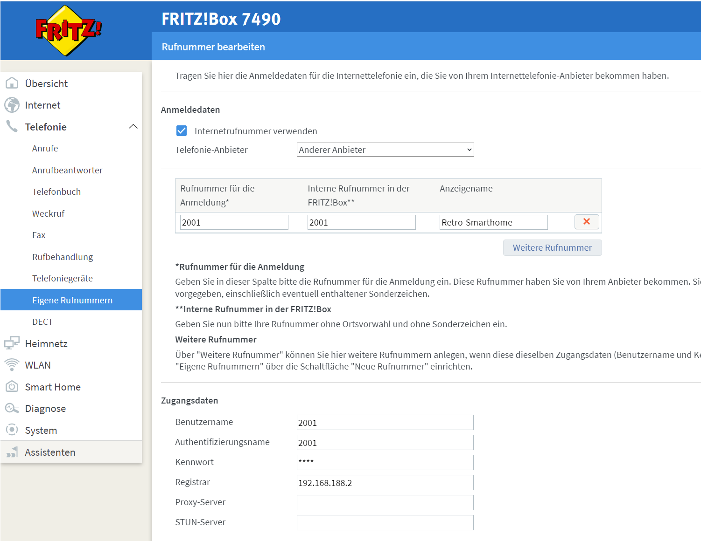

# Retro Smarthome using a RotaryPhone
Control Smarthome using a retro rotary phone

This project shows how to use a rotary phone to control basicaly anything.

Telephone over TAE => Fritz!Box over IP => Asterisk running on a Rasperry Pi

Click to view on YouTube!

[](https://www.youtube.com/watch?v=aAor0zQKUawaAor0zQKUaw)

1) 
Install asterisk 
```bash
sudo apt-get update
sudo apt-get upgrade
sudo apt-get install asterisk
```

2)
clone this repo

3) 
To install the asterisk config files and the triggered smarthome.sh execute init.sh
```bash
./init.sh 
```

4) restart asterisk
```bash
sudo service asterisk restart
```

5) connect Telefone to Fritz!Box
6) Change registar to IP / Hostname of where Asterisk lives for you. The password for this configuration is 1234 as defined asterisk/sip.conf 
[](http://fritz.box/)
 

TODO: init.sh make backups from original asterisk conf
TODO: Add Fritz!Box config

smarthome.sh = /usr/bin/
