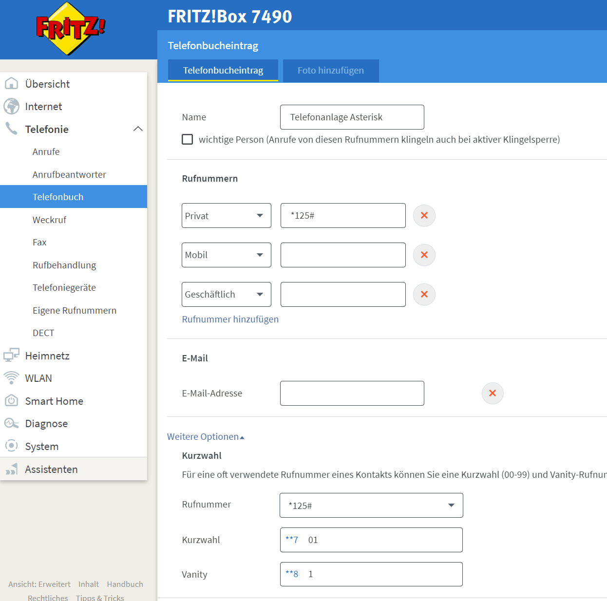

# Retro Smarthome using a RotaryPhone
Control Smarthome using a retro rotary phone

This project shows how to use a rotary phone to control basicaly anything.

Telephone over TAE => Fritz!Box over IP => Asterisk running on a Rasperry Pi

Click to view on YouTube!

[](https://www.youtube.com/watch?v=aAor0zQKUawaAor0zQKUaw)

1) 
Install asterisk 
```bash
sudo apt-get update
sudo apt-get upgrade
sudo apt-get install asterisk
```

2)
clone this repo
```bash
cd ~
git clone https://github.com/dajuly20/RetroSmarthomeWithRotaryPhone
``` 

3) 
To install the asterisk config files and the triggered smarthome.sh execute init.sh
```bash
./init.sh 
```

4) restart asterisk
```bash
sudo service asterisk restart
```

5) connect Telefone to Fritz!Box
6) Change registar to IP / Hostname of where Asterisk lives for you. The password for this configuration is 1234 as defined asterisk/sip.conf 
[](http://fritz.box/)
 
7) create entry in the telephonebook. For Vantity the 1 is the shortest shortdail i could think if, leading to "81" as predail to get put through to the asterisk telephony server. This will evaluate the digits dailed after the 81 by itself (or pass them to smarthome.sh with this configuration)
[](http://fritz.box/)

8) edit smarthome.sh to make it fit your needs. 
9) Connect Phone (if you did not alrady do it in step 5)
10) Make sure your phone is connected.  
11) Dial 81.....  e.g. 8110 calles "./smarthome.sh 10" so all digits after 81 are passed. For my roatary phone, 5 digits are the (time?) timit for it to work.

